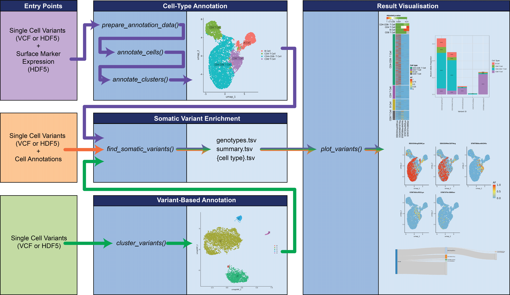

# SCARCE

### Single-Cell Analysis of Rare Clonal Events

------------------------------------------------------------------------

## Overview

**SCARCE** (*Single-Cell Analysis of Rare Clonal Events*) is an R
package for prioritising and visualising **rare somatic mutations** in
single-cell DNA sequencing data such as **MissionBio Tapestri**
datasets.

<figure>

<figcaption aria-hidden="true">Workflow Diagram</figcaption>
</figure>

It provides an integrated pipeline that: - Defines subpopulations of
cells based on surface-marker expression or variant profiling - Runs VEP
variant annotation - Detects and prioritises somatic variants - Performs
cell-type enrichment testing - Generates several statistical reports -
Generates barplots, UMAPs, Sankey plots, and heatmaps for variant-level
visualisation

------------------------------------------------------------------------

## Installation

``` r
# install.packages("devtools")
devtools::install_github("FieldLabFNQOmics/SCARCE")
```

Note: You will also need Ensembl VEP and htslib installed on your
system.

------------------------------------------------------------------------

## Quick Start Example

### Variant-Only Workflow

This workflow requires only variant data, which can be provided in the
form of a .h5 file or .vcf/.vcf.gz

Note: If using VCF input format, SCARCE requires a gzipped input file
with an index generated using Tabix. This can be peformed within SCARCE
using the prep_vcf and prep_vcf_dir arguments of
find_somatic_variants().

A test dataset is provided in inst/extdata/ which is subsampled from the
MissionBio “2 PBMC + KG-1 Sample Mix for PBMC Subclone Identification
Analysis” sample (<https://portal.missionbio.com/>)

``` r
library(SCARCE)
library(Seurat)

input_file <- system.file("extdata", "test_data.h5", package = "SCARCE")

dir.create("results", showWarnings = FALSE)
dir.create("plots", showWarnings = FALSE)

# Configure VEP
vep_config(
  mode="system",
  vep_path="path/to/ensembl-vep/vep",
  cache_dir="path/to/vep_cache",
  fasta="path/to/vep_cache/homo_sapiens/114_GRCh37/Homo_sapiens.GRCh37.75.dna.primary_assembly.fa.gz",
  species="homo_sapiens",
  assembly="GRCh37",
  threads=8,
  cache_version="114",
  perl_bin="path/to/perl5/perlbrew/perls/perl-5.36.3/bin/perl",
  perl_inc=c(
    "path/to/.perlbrew/libs/perl-5.36.3@vep/lib/perl5",
    "path/to/perl5/lib/perl5"
  ),
  perl_path=c(
    "path/to/ensembl-vep",
    "path/to/perl5/perlbrew/perls/perl-5.36.3/bin"
  )
)

# First run find_somatic_variants(run_cell_type_enrichment = FALSE) to filter variants

find_somatic_variants(h5_in = input_file, 
                      run_cell_type_enrichment = F,
                      out_dir = "results",
                      file_prefix = "test_data",
                      block = 10000) # smaller blocks will reduce peak memory usage for larger datasets

# Identify cell clusters/subpopulations based on 100 variant features
# Check output plots in "plots" directory and tweak parameters as required

variant_clusters_seurat <- cluster_variants(
  sample_ID = "test_data",
  genotypes_file = "results/test_data_genotypes.tsv", 
  summary_file = "results/test_data_summary.tsv", 
  plot_directory = "plots", 
  rare_frequency_max = 0.05,
  n_features = 100)

saveRDS(variant_clusters_seurat, "results/seurat_variants.rds")

# Retrieve cell annotations

variant_annotations <- Idents(variant_clusters_seurat)

# Find enriched variants

find_somatic_variants(h5_in = input_file,
                      cell_annotations = variant_annotations,
                      use_vep_file = "results/test_data_vep_annotated.vcf",
                      min_varcount_total = 5,
                      min_varcount_celltype = 5,
                      max_varportion_total = 0.1,
                      out_dir = "results",
                      file_prefix = "test_data_variant_clusters", 
                      block = 10000,
                      run_cell_type_enrichment = T)


# Generate plots

plot_variants(seurat_obj = variant_clusters_seurat,
              umap_reduction = "umap.variants",
              focus_celltype="0",
              file_prefix = "test_data_variant_clusters",
              n_variants = 20,
              result_dir = "results",
              plot_directory = "plots",
              plot_prefix = "test_data_variant_clusters",
              damaging = FALSE,
              priority_only = FALSE,
              pass_only = T,
              min_varcount_total = 2,
              max_alt_portion_total = 0.5,
              topn_col = "p", 
              sankey_min_count = 5,
              include_UMAP_ref = F)
```

### ADT Workflow

This workflow requires antibody-derived tag (ADT) surface marker
expression data as well as variant information, usually provided
together in a .h5 file for MissionBio Tapestri data.

Cell markers may be provided as a list, or (default) may be provided
with the CellMarker2.0 Marker database
(<http://117.50.127.228/CellMarker/CellMarker_download_files/file/Cell_marker_Human.xlsx>)

``` r
library(SCARCE)
library(Seurat)

input_file <- system.file("extdata", "test_data.h5", package = "SCARCE")

dir.create("results", showWarnings = FALSE)
dir.create("plots", showWarnings = FALSE)

# Configure VEP
vep_config(
  mode="system",
  vep_path="path/to/ensembl-vep/vep",
  cache_dir="path/to/vep_cache",
  fasta="path/to/vep_cache/homo_sapiens/114_GRCh37/Homo_sapiens.GRCh37.75.dna.primary_assembly.fa.gz",
  species="homo_sapiens",
  assembly="GRCh37",
  threads=8,
  cache_version="114",
  perl_bin="path/to/perl5/perlbrew/perls/perl-5.36.3/bin/perl",
  perl_inc=c(
    "path/to/.perlbrew/libs/perl-5.36.3@vep/lib/perl5",
    "path/to/perl5/lib/perl5"
  ),
  perl_path=c(
    "path/to/ensembl-vep",
    "path/to/perl5/perlbrew/perls/perl-5.36.3/bin"
  )
)

# Prepare ADT annotation data and create Seurat object

seurat <- prepare_annotation_data(input_file = input_file,
                        sample_ID = "test_data", 
                        cluster_resolutions = 0.2, k_param = 10,
                        save_directory = "results", 
                        qc_plot_directory = "plots")

# Automatically annotate cells and produce QC plots

seurat <- annotate_cells(seurat_obj = seurat,
                         plot_directory = "plots", 
                         CellMarker_path = "path/to/CellMarker2.0/Cell_marker_Human.xlsx")

# After reviewing the output plots in the "plots" directory, determine cluster annotations

manual_annotations <- c(
  "0"="Macrophage_or_Monocyte",
  "1"="CD4 T Cell",
  "2"="CD8 T Cell",
  "3"="B Cell",
  "4"="NK Cell",
  "5"="Plasma Cell",
  "6"="Possible Tumour Cell"
)

seurat <- annotate_clusters(seurat_obj = seurat, annotations = manual_annotations, resolution = 0.2, plot_directory = "results")

saveRDS(seurat, "results/seurat_ADT.rds")

seurat <- readRDS("results/seurat_ADT.rds")

# Retrieve cell annotations

cell_annotations=Idents(seurat)

# Find enriched variants

find_somatic_variants(h5_in = input_file,
                      cell_annotations = cell_annotations,
                      min_varcount_total = 5,
                      min_varcount_celltype = 5,
                      max_varportion_total = 0.1,
                      out_dir = "results",
                      file_prefix = "test_data_ADT_clusters", 
                      block = 10000,
                      priority_only = F, 
                      run_cell_type_enrichment = T,
                      use_vep_file = "results/test_data_ADT_clusters_vep_annotated.vcf"
)

# Generate plots

plot_variants(seurat_obj = seurat,
              umap_reduction = "umap",
              file_prefix = "test_data_ADT_clusters",
              focus_celltype = "Possible Tumour Cell",
              n_variants = 20,
              result_dir = "results",
              plot_directory = "plots",
              plot_prefix = "test_data_ADT_clusters",
              damaging = FALSE,
              priority_only = FALSE,
              min_varcount_total = 2,
              max_alt_portion_total = 0.5,
              topn_col = "p", 
              sankey_min_count = 5,
              include_UMAP_ref = T)
```

### Skip VEP (Fast Example)

For a faster and simpler use-case, users can choose to skip VEP
annotations in either of the above workflows.

``` r
library(SCARCE)
library(Seurat)

input_file <- system.file("extdata", "test_data.h5", package = "SCARCE")

dir.create("results", showWarnings = FALSE)
dir.create("plots", showWarnings = FALSE)

# Prepare ADT annotation data and create Seurat object

seurat <- prepare_annotation_data(input_file = input_file,
                        sample_ID = "test_data", 
                        cluster_resolutions = 0.2, k_param = 10,
                        save_directory = "results", 
                        qc_plot_directory = "plots")

# Automatically annotate cells and produce QC plots

seurat <- annotate_cells(seurat_obj = seurat,
                         plot_directory = "plots", 
                         CellMarker_path = "path/to/CellMarker2.0/Cell_marker_Human.xlsx")

# After reviewing the output plots in the "plots" directory, determine cluster annotations

manual_annotations <- c(
  "0"="Macrophage_or_Monocyte",
  "1"="CD4 T Cell",
  "2"="CD8 T Cell",
  "3"="B Cell",
  "4"="NK Cell",
  "5"="Plasma Cell",
  "6"="Possible Tumour Cell"
)

seurat <- annotate_clusters(seurat_obj = seurat, annotations = manual_annotations, resolution = 0.2, plot_directory = "plots")

saveRDS(seurat, "results/seurat_ADT.rds")

seurat <- readRDS("results/seurat_ADT.rds")

# Retrieve cell annotations

cell_annotations=Idents(seurat)

# Find enriched variants

find_somatic_variants(h5_in = input_file,
                      skip_vep = T,
                      cell_annotations = cell_annotations,
                      min_varcount_total = 5,
                      min_varcount_celltype = 5,
                      max_varportion_total = 0.1,
                      out_dir = "results",
                      file_prefix = "test_data_ADT_clusters", 
                      block = 10000,
                      run_cell_type_enrichment = T
)

# Generate plots

plot_variants(seurat_obj = seurat,
              umap_reduction = "umap",
              file_prefix = "test_data_ADT_clusters",
              focus_celltype = "Possible Tumour Cell",
              n_variants = 20,
              result_dir = "results",
              plot_directory = "plots",
              plot_prefix = "test_data_ADT_clusters",
              min_varcount_total = 2,
              max_alt_portion_total = 0.5,
              topn_col = "p", 
              sankey_min_count = 5,
              include_UMAP_ref = T,
              priority_only = F,
              damaging = F)
```

------------------------------------------------------------------------
